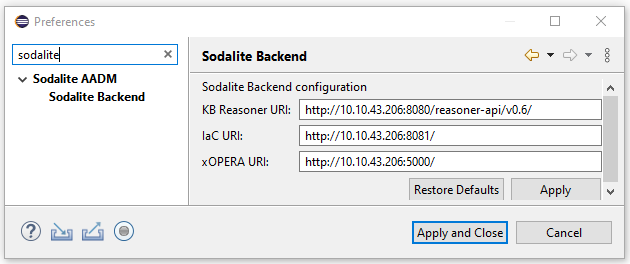

[](https://www.sodalite.eu/)
# IaC platform stack

Implementation of the blueprint and integration tests for the SODALITE platform stack

SODALITE uses IaC, namely the well known Topology and Orchestration Specification for Cloud Applications [TOSCA](https://www.oasis-open.org/committees/tc_home.php?wg_abbrev=tosca) OASIS standard for modelling the infrastructure and application deployment. The TOSCA lifecycle operation interfaces are implemented in [Ansible](https://www.ansible.com/) playbooks and roles. 
This repository contains two TOSCA/Ansible SODALITE stack deployment blueprints which can be deployed by SODALITE orchestrator [xOpera](https://github.com/xlab-si/xopera-opera). First `service.yaml` blueprint located in `./openstack` folder designed for the SODALITE platform supporting [openstack](https://www.openstack.org/) private cloud deployment. Second one, located in `./docker-local` folder represents a local machine docker setup  (not recommended for real development).

In order to proceed with local docker installation use `deploy_local.sh` script that checks and installs all components required for deployment (pip, xOpera, Ansible Roles, etc), provides means for setting up input variables necessary for deployment and starts the deployment itself (script does not include SODALITE IDE installation and configuration). Otherwise one can set up prerequisites for SODALITE stack deployment manually, following these steps:
1. ### Install xOpera 
    Install xOpera and required modules as described here: [xOpera](https://github.com/xlab-si/xopera-opera)    
        *NOTE: Use `--system-site-packages` flag when setting up Python virtual environment in order to avoid this [issue](https://github.com/ansible/ansible/issues/14468)*
1. ### Install required Ansible roles. 
    Ansible roles are listed in the [requirements.yml](docker-local/requirements.yml) Roles installation can be performed using this command:
    ```
    ansible-galaxy install -r docker-local/requirements.yml
    ```
1. ### Generate TLS certificate and key files.
     SODALITE stack requires a private Docker registry to store Docker images. For demonstration purposes a Docker registry container is deployed as a part of SODALITE stack blueprint. In order to make registry accessible to external hosts, is must be secured using TLS certificate. [Docker private registry configuration](https://docs.docker.com/registry/deploying/) TLS certificate and key required for that are not provided in the repository for security reasons and can be generated using the following commands:
    ```
    openssl genrsa -out modules/docker/artifacts/ca.key 4096
    openssl req -new -x509 -key modules/docker/artifacts/ca.key -out modules/docker/artifacts/ca.crt
    ```
1. ### Copy modules 
    Copy TOSCA node types and Ansible playbooks required for deployment into blueprint folders (`./docker-local` or `./openstack`)
    ```
    cp -r modules docker-local/
    cp -r modules openstack/
    ```
1. ### Set up inputs for deployment.
    Input YAML files provided  in the repository are not supposed to be used as is, but rather serve as a template to be populated with actual values. In order for SODALITE stack deployment to proceed some of inputs must be defined. Namely 
    `docker-registry-cert-email-address` used for Docker self signed certificate and Gitlab auth token `XOPERA_GIT_AUTH_TOKEN` that grants access to git repository for TOSCA blueprints. To provide inputs manually edit `input.yaml.tmpl` file and save it as `input.yaml`.

    Openstack deployment of SODALITE stack requires a VM to be instantiated therefore these parameters have to be defined: SSH key, image, flavor and network names plus a comma separated list of security groups.
    ```
    ssh-key-name: 
    image-name: 
    flavor-name:
    openstack-network-name: 
    security-groups:     
    ```
    *NOTE: `security-groups` input must include `sodalite-uc`security group, e.g. `default,remote_access,sodalite-uc`*
1. ### Run blueprint deployment. 
    Go to the folder containing `service.yaml` TOSCA blueprint file (`./docker-local` or `./openstack`) and run the following command `opera deploy -i input.yaml service.yaml`
1. ### Install SODALITE IDE
    Install SODALITE IDE as described here: [SODALITE IDE GitHub](https://github.com/SODALITE-EU/ide). Use **Installation from the Sodalite IDE source code** scenario.
1. ### Configure SODALITE IDE backend connection
    Proceed with SODALITE IDE configuration as described in the [IDE Tutorial](https://docs.google.com/document/d/1w6wYJbTZvBbt5LD6sXReXbx1uPDjefYFAU5KEv8X_8w/edit)
    * Open IDE preference page: menu Window/Preferences. 
    * Search for Sodalite in search text. Click on Sodalite Backend
        
        
    * Edit the URI for the Sodalite Backend services: KB Reasoner, IaC Builder and xOPERA.
        In case of local SODALITE stack deployment use: 
        * http://localhost:8080/reasoner-api/v0.6/ for KB Reasoner  
        * http://localhost:8081/ for IaC Builder
        * http://localhost:5000/ for xOPERA

        For Openstack deployment configuration substitute `localhost` with VM public IP address. 

NOTE: SODALITE currently uses the version [xOpera version 0.5.7](https://pypi.org/project/opera/0.5.7/) since xOpera is being developed to support [OASIS TOSCA Simple Profile in YAML version 1.3](https://www.oasis-open.org/news/announcements/tosca-simple-profile-in-yaml-v1-3-oasis-standard-published).


